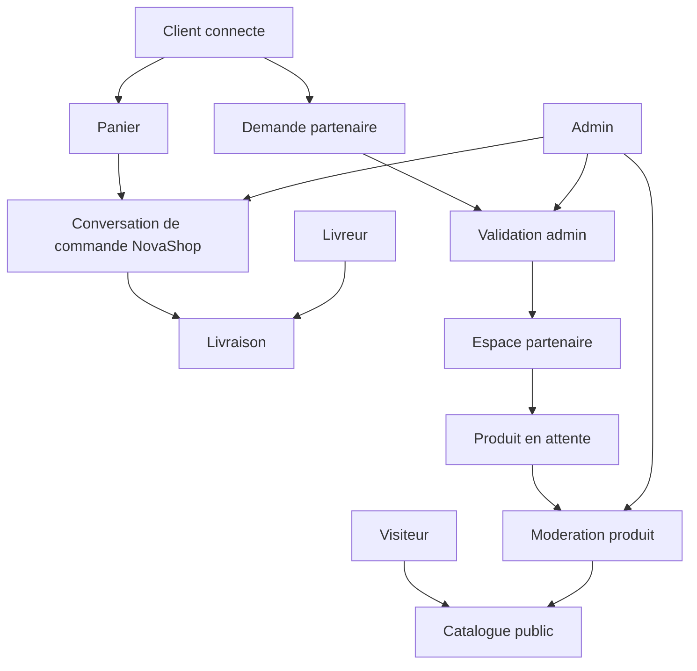

# NovaShop - Cas d'utilisation applicatifs

Ce document decrit les cas d'utilisation possibles de NovaShop dans son modele cible actuel :

- une marketplace centralisee sous la marque NovaShop ;
- un catalogue public unifie ;
- des partenaires invisibles cote client ;
- des demandes, produits, commandes, messages, notifications et validations admin stockes dans Supabase ;
- aucune donnee metier critique stockee localement ;
- une commande principale pilotee par conversation NovaShop plutot que par un checkout classique.

Il sert de reference produit, technique et QA. Toute nouvelle fonctionnalite doit rester compatible avec ces regles.

## 1. Acteurs

### Visiteur

Utilisateur non connecte. Il peut decouvrir NovaShop sans creer de compte.

Capacites :

- ouvrir l'application ;
- consulter l'accueil ;
- explorer le catalogue public ;
- consulter les categories ;
- rechercher des produits ;
- ouvrir une fiche produit publiee ;
- consulter l'aide, la FAQ, les pages legales et le contact ;
- commencer une action qui necessite un compte, puis etre invite a se connecter ou creer un compte.

Limites :

- pas de commande ;
- pas de favoris persistants ;
- pas d'avis ;
- pas de demande partenaire ;
- pas d'acces notifications, adresses ou historique ;
- pas d'acces partenaire, admin ou livreur.

### Client connecte

Utilisateur Supabase Auth avec role `client`.

Capacites :

- tout ce qu'un visiteur peut faire ;
- gerer son profil ;
- gerer ses adresses ;
- ajouter des favoris ;
- ajouter des produits au panier ;
- choisir des variantes ;
- demarrer une commande par message ;
- suivre une conversation de commande NovaShop ;
- confirmer une livraison quand la commande est marquee livree ;
- consulter les notifications ;
- publier un avis produit ;
- demander a devenir partenaire depuis Aide & support.

Limites :

- ne voit jamais le nom d'un partenaire ;
- ne voit jamais une page boutique publique ;
- ne peut pas lire les conversations ou demandes d'un autre client ;
- ne peut pas valider ses propres produits ou demandes ;
- ne peut pas acceder a l'administration.

### Demandeur partenaire

Client connecte ayant depose une demande partenaire.

Capacites :

- consulter le statut de sa derniere demande ;
- recevoir une notification si la demande est approuvee ou refusee ;
- ne pas soumettre une nouvelle demande active tant qu'une demande existe ;
- refaire une demande seulement si la logique produit/admin autorise une nouvelle demande apres refus ou archivage.

Statuts attendus :

- `new` : demande recue ;
- `reviewing` : demande en cours d'analyse ;
- `approved` : acces partenaire debloque ;
- `rejected` : demande refusee avec note admin ;
- `archived` : dossier historique non actif.

### Partenaire approuve

Utilisateur dont la demande a ete approuvee et qui possede un profil interne `vendors`.

Capacites :

- acceder a l'espace partenaire ;
- ajouter un produit ;
- choisir une categorie puis une sous-categorie si necessaire ;
- remplir un formulaire adapte a la taxonomie ;
- ajouter plusieurs images produit ;
- declarer variantes, options, prix et stock ;
- soumettre un produit en `pending_review` ;
- suivre ses produits par statut ;
- suivre les commandes liees a ses produits ;
- gerer ses stocks ;
- consulter des analytics simples ;
- consulter les notes de refus admin.

Limites :

- pas de nom public visible cote client ;
- pas de boutique publique ;
- pas de page sociale partenaire ;
- pas d'avis boutique public ;
- pas de publication directe d'un produit sans validation admin ;
- pas de modification qui rend un produit publie sans nouvelle validation si la moderation l'exige.

### Admin

Utilisateur Supabase avec role `admin`.

Capacites :

- acceder a l'interface Administration ;
- consulter les demandes partenaires ;
- ouvrir les images privees via signed URLs ;
- passer une demande en analyse ;
- approuver ou refuser une demande ;
- creer/activer le profil partenaire interne ;
- generer des notifications reelles ;
- consulter et moderer les produits en attente ;
- publier ou refuser un produit avec note obligatoire au refus ;
- consulter les conversations de commande ;
- consulter utilisateurs, partenaires, notifications et audit ;
- gerer categories, sous-categories, ordre, activation et templates de formulaire.

Limites :

- doit agir sur Supabase, jamais sur un cache local ;
- doit laisser une trace d'audit pour les decisions importantes ;
- ne doit pas exposer l'identite partenaire au client.

### Livreur

Utilisateur avec role `driver`.

Capacites :

- acceder a l'espace livreur ;
- consulter sa tournee ;
- consulter les livraisons assignees ;
- ouvrir le detail d'une livraison ;
- mettre a jour les statuts logistiques autorises ;
- consulter ses gains.

Limites :

- ne lit pas les donnees admin ;
- ne lit pas les demandes partenaires ;
- ne voit que les livraisons qui lui sont liees, sauf role admin.

### Support NovaShop

Equipe interne pouvant repondre au client dans les conversations de commande via l'identite visible NovaShop.

Capacites :

- repondre dans une conversation de commande ;
- demander des informations de livraison ;
- clarifier le stock ou une variante ;
- informer sur la preparation, livraison ou annulation ;
- rester toujours visible comme NovaShop.

Limites :

- ne doit jamais signer comme partenaire ;
- ne doit jamais transmettre une identite partenaire au client.

## 2. Principes transverses

### Identite publique unique

Le client voit :

```txt
NovaShop -> Produits -> Variantes -> Panier -> Conversation -> Livraison
```

Le client ne voit pas :

- vendu par X ;
- boutique X ;
- page partenaire ;
- profil vendeur ;
- avis boutique ;
- followers, reseaux sociaux ou slogan partenaire.

### Supabase comme source de verite

Les donnees metier suivantes doivent venir de Supabase :

- comptes et profils ;
- produits ;
- variantes ;
- images produit ;
- panier transformable en conversation ;
- conversations et messages ;
- commandes ;
- demandes partenaires ;
- notifications ;
- validations admin ;
- categories ;
- adresses ;
- favoris ;
- avis ;
- coupons ;
- livraisons.

Les donnees locales autorisees :

- theme ;
- preferences d'interface ;
- etat UI non decisionnel ;
- cache technique non utilise pour valider une action metier.

### Erreurs explicites

En cas de probleme reseau, RLS, auth ou storage :

- l'action doit echouer clairement ;
- l'utilisateur doit voir une erreur comprehensible ;
- aucune reussite locale silencieuse n'est autorisee ;
- aucun fallback metier ne doit simuler un succes.

## 3. Carte des domaines



## 4. Cas d'utilisation visiteur

### UC-VIS-01 - Ouvrir l'application sans compte

Objectif : permettre la decouverte immediate.

Declencheur : lancement de l'application.

Preconditions :

- application installee ;
- Supabase initialisable.

Flux nominal :

1. L'utilisateur ouvre l'application.
2. L'accueil s'affiche directement.
3. Aucun compte n'est demande au demarrage.
4. Le visiteur peut naviguer dans l'accueil, le catalogue, l'assistant et le profil.

Variantes :

- Si une session Supabase existe, l'application restaure le compte.
- Si une ancienne session locale existe, elle doit etre ignoree/invalidee et inviter a se reconnecter proprement.

Erreurs :

- Si Supabase est indisponible, afficher une erreur de chargement ou des etats vides explicites selon l'ecran.

### UC-VIS-02 - Explorer le catalogue public

Objectif : voir les produits publies.

Flux nominal :

1. Le visiteur ouvre l'onglet Catalogue.
2. L'application charge les categories actives.
3. L'application charge uniquement les listings `published`.
4. Les produits s'affichent sans mention partenaire.

Regles :

- Les produits `draft`, `pending_review`, `rejected` et `archived` ne sont jamais visibles publiquement.
- Les variantes et images sont visibles uniquement pour les produits publies.
- Les categories inactives ne doivent pas structurer le catalogue public.

### UC-VIS-03 - Rechercher un produit

Objectif : trouver rapidement un produit.

Flux nominal :

1. Le visiteur ouvre la recherche.
2. Il saisit une requete.
3. Les resultats affichent produits et categories.
4. Les suggestions partenaire ou boutique sont exclues.

Cas limites :

- Requete vide : afficher suggestions produit/categorie ou etat initial.
- Aucun resultat : proposer de modifier la recherche.
- Erreur reseau : afficher retry.

### UC-VIS-04 - Consulter une fiche produit

Objectif : evaluer un produit avant achat.

Contenu attendu :

- images produit ;
- titre ;
- prix ;
- stock ;
- variantes ;
- description ;
- avis produit ;
- bouton panier ou commande par message selon le contexte.

Interdits :

- carte vendeur ;
- nom partenaire ;
- lien boutique ;
- avis boutique ;
- phrase "vendu par".

## 5. Cas d'utilisation auth et profil

### UC-AUTH-01 - Creer un compte client

Objectif : permettre les actions personnelles.

Flux nominal :

1. L'utilisateur ouvre inscription.
2. Il renseigne prenom, nom, email, telephone facultatif et mot de passe.
3. Il accepte les conditions.
4. L'application cree un compte Supabase Auth.
5. L'application cree ou met a jour `public.users`.
6. Le role par defaut est `client`, sauf regle admin explicite.

Regles :

- Les nouveaux identifiants doivent etre des UUID Supabase Auth.
- Aucun identifiant local `user-*` ne doit etre cree.
- Les erreurs Supabase doivent etre affichees.

### UC-AUTH-00 - Choisir un parcours d'entree

Objectif : orienter l'utilisateur sans bloquer la decouverte.

Flux nominal :

1. L'utilisateur peut arriver sur l'accueil sans compte.
2. S'il lance un parcours de compte, l'application peut lui proposer un role d'intention : acheter, proposer des produits, livrer.
3. Le compte cree reste d'abord un compte Supabase Auth reel.
4. Les droits specifiques ne sont debloques qu'apres validation ou role effectif.

Regles :

- Choisir "proposer des produits" ne doit pas creer automatiquement un partenaire approuve.
- Choisir "livrer" ne doit pas donner acces aux livraisons sans validation ou profil livreur.
- Le role public par defaut reste client tant que le backend ne confirme pas mieux.

### UC-AUTH-02 - Connexion

Flux nominal :

1. L'utilisateur saisit email et mot de passe.
2. Supabase Auth valide la session.
3. Le profil `public.users` est charge.
4. Les onglets s'adaptent au role.

Variantes :

- Role `client` : Accueil, Catalogue, Assistant, Profil.
- Role `partner/seller` : Accueil, Produits, Assistant, Profil.
- Role `driver` : Tournee, Livraisons, Assistant, Profil.
- Role `admin` : acces admin via Profil.

### UC-AUTH-03 - Mot de passe oublie

Flux nominal :

1. L'utilisateur demande une reinitialisation.
2. Supabase envoie un lien.
3. Le deeplink `novaishop://reset-password` ouvre l'ecran de reset.
4. L'utilisateur definit un nouveau mot de passe.

Erreurs :

- Lien expire : afficher un message clair.
- Session de recovery absente : inviter a refaire la demande.

### UC-AUTH-04 - Changer son mot de passe

Objectif : permettre a un utilisateur connecte de securiser son compte.

Flux nominal :

1. L'utilisateur ouvre Profil ou Reglages.
2. Il choisit Changer le mot de passe.
3. Il saisit le nouveau mot de passe selon les contraintes.
4. Supabase Auth met a jour le mot de passe.
5. L'application confirme la reussite.

Regles :

- L'utilisateur doit etre connecte.
- Les erreurs Supabase doivent etre affichees.
- Aucune sauvegarde locale du mot de passe n'est autorisee.

### UC-AUTH-05 - Verifier son e-mail

Objectif : confirmer que le compte vient bien de l'adresse e-mail declaree.

Flux nominal :

1. Apres inscription, Supabase envoie le code ou lien de verification.
2. L'utilisateur saisit le code recu.
3. L'application appelle Supabase Auth pour verifier l'OTP.
4. Supabase retourne une session valide.
5. Le profil `public.users` est cree ou recharge avec l'UUID Supabase Auth.

Regles :

- L'application ne doit jamais marquer un compte comme verifie sans validation Supabase Auth.
- Le bouton "renvoyer le code" doit appeler Supabase, pas simuler une reussite.
- Si le lien ou code expire, l'utilisateur doit pouvoir demander un nouveau code.
- Si le projet Supabase retourne deja une session a l'inscription, l'application ne doit pas afficher un ecran OTP fictif.

### UC-PRO-01 - Modifier son profil

Objectif : tenir a jour les informations personnelles.

Donnees :

- nom ;
- email via Supabase Auth si autorise ;
- telephone ;
- avatar eventuel.

Regles :

- Un client ne peut modifier que son propre profil.
- Un admin peut consulter ou moderer selon policies.

### UC-PRO-02 - Consulter notifications

Flux nominal :

1. Le client ouvre la cloche.
2. Le compteur non lu vient de Supabase.
3. Les notifications sont listees.
4. Le client marque une notification comme lue ou toutes comme lues.

Notifications attendues :

- demande partenaire approuvee ;
- demande partenaire refusee ;
- produit partenaire publie/refuse ;
- changement de statut commande ;
- message NovaShop ;
- systeme.

### UC-PRO-03 - Gerer ses reglages

Objectif : personnaliser l'experience sans toucher aux donnees metier.

Capacites :

- changer le theme ;
- consulter la version ;
- ouvrir profil, mot de passe, support ;
- regler des preferences d'interface si elles existent.

Regles :

- Les preferences locales sont autorisees uniquement pour l'UI.
- Les reglages ne doivent pas contenir de validation metier locale.

### UC-PRO-04 - Se deconnecter

Objectif : fermer proprement la session d'un appareil.

Flux nominal :

1. L'utilisateur ouvre Profil ou Reglages.
2. Il confirme la deconnexion.
3. Supabase Auth ferme la session.
4. L'application revient a un etat visiteur.

Regles :

- Aucun role ni droit ne doit survivre apres deconnexion.
- Les preferences UI peuvent rester locales.
- Les donnees metier protegees doivent etre rechargees depuis Supabase a la prochaine connexion.

### UC-PRO-05 - Demander la suppression du compte

Objectif : donner un chemin clair pour exercer un droit de suppression.

Flux nominal :

1. L'utilisateur ouvre Reglages.
2. Il choisit Supprimer mon compte.
3. L'application ouvre un message support pre-rempli ou un flux backend dedie si disponible.
4. NovaShop traite la demande cote admin/support.

Regles :

- La suppression effective doit etre executee cote serveur/admin avec audit.
- L'application mobile ne doit pas supprimer localement des donnees en pretendant que le compte est supprime.
- Les impacts sur commandes, demandes partenaires, produits et documents KYC doivent etre controles avant execution.

## 6. Cas d'utilisation catalogue et produit

### UC-CAT-01 - Consulter categories et sous-categories

Flux nominal :

1. L'application charge les categories actives.
2. Les categories racines sont affichees.
3. Les sous-categories permettent de filtrer les produits.

Regles :

- `active=false` masque la categorie au public.
- `sort_order` pilote l'ordre d'affichage.
- `form_template` pilote les formulaires partenaire.

### UC-CAT-02 - Filtrer une categorie

Objectif : voir les produits d'une categorie ou sous-categorie.

Flux nominal :

1. L'utilisateur choisit une categorie.
2. L'application charge les produits publies de cette categorie.
3. L'utilisateur peut ouvrir un produit.

Cas limites :

- Categorie sans produit : etat vide.
- Categorie inactive : ne doit pas etre proposee publiquement.

### UC-CAT-03 - Consulter les ventes flash

Objectif : mettre en avant des produits publies en promotion temporaire.

Flux nominal :

1. L'utilisateur ouvre la section Ventes flash depuis l'accueil ou le catalogue.
2. L'application charge uniquement les produits publies marques en promotion.
3. Le compte a rebours ou la date de fin est affiche.
4. L'utilisateur ouvre une fiche produit et suit le parcours normal.

Regles :

- Un produit en vente flash reste soumis a `status = published`.
- Une promotion expiree ne doit plus etre mise en avant.
- Le partenaire reste invisible.

### UC-CAT-04 - Gerer les types catalogue herites

Contexte : le code conserve des types `product`, `service`, `property` pour compatibilite.

Regles actuelles :

- Le modele cible public prioritaire est le produit physique ou assimilable.
- Les services/proprietes ne doivent pas recreer des pages vendeur ou boutique publique.
- Toute extension future vers service/property doit passer par catalogue NovaShop, moderation admin et partenaire invisible.

### UC-PROD-01 - Selectionner une variante

Objectif : commander le bon produit.

Flux nominal :

1. La fiche produit detecte des variantes actives.
2. L'utilisateur choisit les options requises.
3. Le prix, l'image ou le stock peuvent s'adapter.
4. Le panier stocke `productId + variantId/options`.

Regles :

- Si un produit a des variantes, selection obligatoire avant panier.
- Le total utilise le prix variante si present.
- Le stock doit etre revalide cote serveur a la creation de conversation.

### UC-PROD-02 - Consulter et publier un avis produit

Flux nominal :

1. Le client consulte les avis d'un produit.
2. Il ouvre "Donner mon avis".
3. Il note et commente.
4. L'avis est insere dans Supabase.

Regles :

- Les avis partenaires/boutiques sont bloques.
- Les avis produit peuvent etre publics selon RLS.
- Un client doit etre connecte.

## 7. Cas d'utilisation panier et commande par message

### UC-CART-01 - Ajouter au panier

Flux nominal :

1. L'utilisateur ouvre une fiche produit.
2. Il choisit les variantes si necessaire.
3. Il choisit une quantite.
4. Il ajoute au panier.

Regles :

- Le panier ne constitue pas une reservation de stock.
- Le panier ne doit pas stocker une verite metier permanente.
- Le prix doit etre revalide au moment de la creation de conversation.

### UC-CART-02 - Modifier le panier

Flux nominal :

1. Le client ouvre le panier.
2. Il augmente, reduit ou retire une ligne.
3. Le total se recalcule.

Cas limites :

- Quantite nulle : suppression de ligne.
- Stock devenu insuffisant : erreur au moment de commander par message.

### UC-ORDER-01 - Commander par message

Objectif : remplacer le checkout classique expose.

Preconditions :

- utilisateur connecte ;
- panier non vide ;
- produits publies ;
- stock disponible ;
- variantes valides.

Flux nominal :

1. Le client appuie sur "Commander par message".
2. L'application appelle `create_order_conversation_from_cart`.
3. Supabase derive `customer_id` depuis la session.
4. Supabase revalide produits, prix, stock et variantes.
5. Une conversation est creee avec un recapitulatif systeme.
6. Le panier est vide localement.
7. L'ecran conversation s'ouvre.

Erreurs :

- Non connecte : inviter a se connecter.
- Produit non publie : afficher que le produit n'est plus disponible.
- Stock insuffisant : afficher le produit concerne.
- Prix modifie : afficher et demander de relancer.
- RLS refuse : message explicite.

### UC-ORDER-02 - Echanger avec NovaShop

Flux nominal :

1. Le client envoie un message.
2. Le message est stocke dans `conversation_messages`.
3. Les nouveaux messages arrivent en realtime.
4. Les messages NovaShop restent signes NovaShop.

Regles :

- Un partenaire ne doit pas apparaitre publiquement.
- Les messages partenaires eventuels doivent etre relayes/masques derriere NovaShop.
- Un client lit uniquement ses conversations.

### UC-ORDER-03 - Suivre le statut de conversation

Statuts :

- `draft` ;
- `awaiting_confirmation` ;
- `confirmed` ;
- `preparing` ;
- `out_for_delivery` ;
- `delivered` ;
- `buyer_confirmed` ;
- `cancelled`.

Flux nominal :

1. Le statut change dans Supabase.
2. L'ecran actif recoit la mise a jour.
3. Le client voit l'etat courant.

### UC-ORDER-04 - Confirmer la livraison

Preconditions :

- conversation du client ;
- statut `delivered`.

Flux nominal :

1. Le client voit l'action de confirmation.
2. Il confirme la bonne reception.
3. L'application appelle `confirm_order_conversation_delivery`.
4. Supabase passe la conversation a `buyer_confirmed`.
5. Un evenement de conversation est ajoute.

Erreurs :

- Statut non `delivered` : action invisible ou refusee.
- Mauvais client : RLS/RPC refuse.

### UC-ORDER-05 - Ancien checkout

Regle :

- Les routes legacy `/checkout`, `/payment`, `/payment/methods` ne doivent plus exposer de paiement classique.
- Elles doivent ramener au panier ou afficher indisponible.
- Aucun paiement local ou mock ne doit creer une commande reelle.

### UC-ORDER-06 - Consulter l'historique des commandes

Objectif : permettre au client de retrouver ses commandes et conversations.

Flux nominal :

1. Le client ouvre Profil puis Mes commandes.
2. L'application charge les commandes Supabase liees a `customer_id`.
3. Le client voit les commandes recentes, leur statut et leur total.
4. Il ouvre le detail d'une commande.

Regles :

- Un client ne lit que ses commandes.
- L'admin peut lire toutes les commandes selon RLS.
- Les commandes creees par conversation doivent rester coherentes avec le thread NovaShop.

### UC-ORDER-07 - Ouvrir le detail et le suivi commande

Flux nominal :

1. Le client ouvre une commande.
2. Il consulte les articles, montant, statut et etapes.
3. Il ouvre le suivi si disponible.
4. Il revient vers la conversation NovaShop pour toute clarification.

Regles :

- Le detail ne doit pas afficher le partenaire.
- Les etapes de tracking doivent rester compatibles avec les statuts conversation et livraison.
- Si le paiement reel n'est pas branche, l'ecran ne doit pas simuler un paiement reussi.

## 8. Cas d'utilisation favoris, adresses et coupons

### UC-WISH-01 - Ajouter un favori

Preconditions :

- client connecte ;
- produit publie.

Flux :

1. Le client appuie sur favori.
2. Supabase insere `wishlist_items`.
3. Le client retrouve le produit dans Favoris.

Regles :

- Un client ne lit que ses favoris.
- Un produit non publie ne doit pas etre favorise publiquement.

### UC-WISH-02 - Retirer un favori

Flux :

1. Le client ouvre Favoris ou une fiche produit.
2. Il retire le produit des favoris.
3. Supabase supprime la ligne `wishlist_items`.
4. La liste se rafraichit.

Regles :

- Le retrait doit etre serveur/RLS.
- Un echec Supabase doit laisser le favori visible et afficher une erreur.

### UC-ADDR-01 - Ajouter une adresse

Flux :

1. Le client ouvre Adresses.
2. Il ajoute libelle, ligne, ville, pays, telephone.
3. Supabase stocke l'adresse avec `user_id`.

Regles :

- Une adresse appartient a un utilisateur.
- La suppression et la mise par defaut sont serveur/RLS.

### UC-ADDR-02 - Modifier, supprimer ou definir une adresse par defaut

Flux :

1. Le client ouvre son carnet d'adresses.
2. Il choisit modifier, supprimer ou definir par defaut.
3. Supabase applique l'action sur ses propres adresses.
4. L'interface affiche l'etat a jour.

Regles :

- Une suppression ne doit jamais etre seulement locale.
- Une adresse par defaut doit rester unique par utilisateur si la contrainte existe cote serveur.
- Les commandes deja passees doivent conserver leur historique d'adresse.

### UC-COUPON-01 - Valider un coupon

Flux :

1. Le client saisit un code.
2. Supabase verifie le coupon actif, dates, usage et montant minimum.
3. La reduction est calculee.

Regles :

- Un coupon partenaire reste interne.
- La validation ne doit pas se baser sur une liste locale ni sur une lecture publique de `coupons`.
- Le client doit passer par une verification Supabase/RPC qui ne retourne pas `vendor_id`.
- Le coupon n'est definitif qu'au moment de la commande/paiement reel.

## 9. Cas d'utilisation demande partenaire

### UC-PARTAPP-01 - Decouvrir l'entree partenaire

Flux :

1. Le client ouvre Profil.
2. Il ouvre Aide & support.
3. Il choisit "Proposer mes produits sur NovaShop".

Regles :

- L'entree reste discrete.
- Elle ne transforme pas l'application en marketplace multi-boutiques publique.

### UC-PARTAPP-02 - Invitation a creer un compte

Precondition : visiteur non connecte.

Flux :

1. Le visiteur ouvre "Proposer mes produits".
2. L'application explique qu'un compte client est requis.
3. L'utilisateur cree ou connecte son compte.
4. Il revient au formulaire.

### UC-PARTAPP-03 - Soumettre une demande

Donnees requises :

- numero WhatsApp ;
- description des produits vendus ;
- trois images de produits.

Flux :

1. Le client remplit le formulaire.
2. Les images sont envoyees dans le bucket prive `private-kyc`.
3. La demande est inseree dans `partner_applications`.
4. Le statut initial est `new`.
5. Le client voit un ecran de statut.

Regles :

- Exactement trois images.
- Images confidentielles : path prive + signed URL pour admin/owner.
- Pas de base64 en base pour les nouvelles demandes.
- Une seule demande active par utilisateur.

### UC-PARTAPP-04 - Revoir son statut

Flux :

1. Le client quitte l'application.
2. Il revient plus tard.
3. Il reclique "Proposer mes produits".
4. L'application lit la derniere demande Supabase.
5. Elle affiche le statut au lieu de rouvrir un formulaire actif.

### UC-PARTAPP-05 - Notification de decision

Flux :

1. L'admin approuve ou refuse.
2. Supabase met a jour la demande.
3. Une notification in-app est creee.
4. Le badge cloche augmente.
5. Le client ouvre la notification.

Variantes :

- Si push FCM configure : envoyer push.
- Si push non configure : in-app obligatoire.

## 10. Cas d'utilisation partenaire

### UC-PART-01 - Acceder a l'espace partenaire

Preconditions :

- utilisateur connecte ;
- demande approuvee ;
- profil vendor actif.

Flux :

1. Le role utilisateur ou dashboard indique l'acces partenaire.
2. Le profil affiche "Espace partenaire".
3. L'utilisateur ouvre son espace.
4. Les donnees sont chargees depuis Supabase.

Erreurs :

- Pas de profil vendor : afficher "demande non approuvee".
- RLS refuse : inviter a se reconnecter ou contacter support.

### UC-PART-02 - Ajouter un produit

Flux :

1. Le partenaire appuie sur ajouter produit.
2. Il choisit categorie.
3. Si la categorie a des enfants, il choisit sous-categorie.
4. Le formulaire adapte s'affiche.
5. Il remplit titre, description, prix, stock, attributs.
6. Il ajoute une ou plusieurs images.
7. Il declare les variantes si pertinent.
8. Il soumet.
9. Supabase cree un listing `pending_review`.

Regles :

- `vendor_id` et `shop_id` sont deduits cote serveur.
- `partner_user_id` est interne.
- Le produit n'est pas public avant validation.
- Les images multiples vont dans `listing_images`.
- Les variantes vont dans `product_variants`.

Templates de formulaire :

- `standard` : titre, description, prix, stock, images ;
- `fashion` : taille, couleur, matiere, genre, coupe, entretien ;
- `bag` : dimensions, matiere, couleur, volume ;
- `beauty` : volume, ingredients, type de peau ;
- `electronics` : marque, modele, etat, garantie ;
- `laptop` : processeur, RAM, stockage, GPU, ecran, resolution, OS, batterie, ports.

### UC-PART-03 - Suivre moderation produit

Statuts :

- `draft` ;
- `pending_review` ;
- `published` ;
- `rejected` ;
- `archived`.

Flux :

1. Le partenaire consulte ses produits.
2. Il voit le statut.
3. Si refuse, il voit la note admin.
4. Il corrige et resoumet si autorise.

### UC-PART-03B - Modifier un produit existant

Objectif : permettre au partenaire de corriger une fiche ou mettre a jour stock/prix.

Flux nominal :

1. Le partenaire ouvre un produit depuis son espace.
2. Il modifie les champs autorises.
3. La modification repasse en `pending_review` si elle impacte la fiche publique.
4. L'admin revalide si necessaire.

Regles :

- Les changements critiques ne doivent pas contourner la moderation.
- Le partenaire ne peut modifier que ses propres produits.
- Les modifications restent invisibles publiquement jusqu'a publication.

### UC-PART-03C - Gerer les documents KYC

Objectif : verifier ou completer le dossier partenaire selon les besoins operationnels.

Flux nominal :

1. Le partenaire ouvre le centre KYC ou dossier.
2. Il consulte les documents ou statuts demandes.
3. Il upload les fichiers requis.
4. Les fichiers sont stockes dans un espace prive.
5. L'admin peut consulter et valider/refuser.

Regles :

- Les documents KYC ne sont jamais publics.
- Les documents doivent utiliser Storage prive et URLs signees.
- Le statut KYC ne doit pas etre simule localement.

### UC-PART-04 - Gerer commandes liees

Flux :

1. Le partenaire ouvre Commandes.
2. Il voit les commandes contenant ses produits.
3. Il met a jour les statuts autorises.
4. NovaShop reste l'identite client.

Regles :

- Le partenaire ne voit pas les produits des autres partenaires.
- Le client ne voit pas le partenaire.

### UC-PART-05 - Analytics partenaire

Indicateurs utiles :

- nombre de produits ;
- produits publies ;
- produits en attente ;
- stock faible ;
- commandes actives ;
- chiffre d'affaires estime ;
- panier moyen ;
- distribution des statuts de commandes.

Regles :

- Les chiffres viennent de Supabase.
- Aucune analytics fictive ne doit etre affichee.

### UC-PART-06 - Coupons partenaire

Flux :

1. Le partenaire cree un coupon si le module est autorise.
2. Le coupon est stocke dans Supabase.
3. L'admin peut moderer ou auditer.

Regles :

- Un coupon partenaire ne doit pas exposer l'identite partenaire au client.
- Un partenaire ne doit lire et modifier que ses propres coupons.
- Les coupons ne doivent pas etre listables publiquement depuis l'application.
- Les coupons doivent respecter les contraintes d'usage.

### UC-PART-07 - Upload de medias produit

Objectif : centraliser les images publiques et privees.

Flux nominal :

1. Le partenaire choisit une image.
2. L'application upload vers Supabase Storage.
3. L'URL ou le path retourne est associe au produit.
4. Les images publiques produit peuvent etre affichees si le produit est publie.

Regles :

- Les images de demande/KYC restent privees.
- Les images produit publiees peuvent etre publiques.
- Un upload echoue doit bloquer la soumission si l'image est requise.

## 11. Cas d'utilisation admin

### UC-ADMIN-01 - Acceder a l'administration

Preconditions :

- utilisateur connecte ;
- role `admin`.

Flux :

1. L'admin ouvre Profil.
2. Il voit Administration.
3. Le guard verifie le role.
4. L'ecran admin charge les sections.

Erreurs :

- Non admin : acces refuse.
- RLS refuse : erreur explicite.

### UC-ADMIN-02 - Traiter une demande partenaire

Flux :

1. L'admin ouvre l'onglet Demandes.
2. Il voit demandes `new` et `reviewing`.
3. Il consulte WhatsApp, description, images signees, email, statut, notes.
4. Il passe en analyse si besoin.
5. Il approuve ou refuse.
6. Supabase met a jour la demande.
7. Si approuve : profil partenaire cree/active.
8. Notification in-app creee.
9. Audit event cree.

Regles :

- Refus avec note recommandee.
- Approbation doit debloquer l'espace partenaire.
- Les images privees ne doivent pas devenir publiques.

### UC-ADMIN-03 - Moderer un produit

Flux :

1. L'admin ouvre Produits a valider.
2. Il consulte les produits `pending_review`.
3. Il inspecte titre, description, prix, stock, images et attributs.
4. Il valide ou refuse.
5. En cas de refus, note obligatoire.
6. Supabase change le statut et cree notification/audit.

Regles :

- Un produit publie devient visible cote client.
- Un produit refuse reste invisible.
- La moderation passe par RPC securisee.

### UC-ADMIN-04 - Gerer categories

Flux :

1. L'admin ouvre Categories.
2. Il cree ou modifie categorie/sous-categorie.
3. Il choisit slug, parent, ordre, activation et template formulaire.
4. Supabase applique la modification.

Regles :

- Seul admin modifie.
- `active=false` masque au public.
- Changer `form_template` impacte les formulaires partenaire.

### UC-ADMIN-05 - Consulter conversations

Flux :

1. L'admin ouvre Messages.
2. Il voit les conversations recentes.
3. Il peut identifier statut, client et evolution.

Regles :

- L'admin repond comme NovaShop.
- Les partenaires restent masques.

### UC-ADMIN-06 - Consulter utilisateurs et partenaires

Flux :

1. L'admin ouvre Users.
2. Il voit les utilisateurs Supabase.
3. Il identifie role et statut partenaire.

Regles :

- Les donnees sensibles doivent rester minimales.
- Toute action de role doit etre auditee si ajoutee plus tard.

### UC-ADMIN-07 - Consulter notifications et audit

Flux :

1. L'admin ouvre Notifications ou Audit.
2. Il consulte les derniers evenements.

Evenements attendus :

- demande approuvee/refusee ;
- produit publie/refuse ;
- changement de statut commande ;
- action admin importante ;
- erreur metier notable si journalisee.

## 12. Cas d'utilisation livraison

### UC-DRV-01 - Devenir livreur

Flux possible :

1. L'utilisateur ouvre inscription livreur.
2. Il fournit les informations requises.
3. Supabase cree ou met a jour `delivery_drivers`.
4. Le statut initial est soumis/en attente selon modele.

Regles :

- Le role livreur ne doit pas donner acces admin.
- L'activation peut necessiter validation interne.

### UC-DRV-02 - Voir sa tournee

Flux :

1. Le livreur ouvre Tournee.
2. Il voit les livraisons assignees.
3. Il consulte adresses, client, statut, horaires.

Regles :

- Un livreur ne voit que ses livraisons.
- Un admin peut voir toutes les livraisons.

### UC-DRV-03 - Mettre a jour une livraison

Statuts possibles :

- `assigned` ;
- `accepted` ;
- `picked_up` ;
- `in_transit` ;
- `delivered` ;
- `failed` ;
- `cancelled`.

Flux :

1. Le livreur ouvre une livraison.
2. Il avance le statut.
3. Supabase met a jour.
4. Le client/admin peut etre notifie.

Regles :

- Les transitions doivent etre controlees.
- La livraison `delivered` peut debloquer la confirmation client.

### UC-DRV-04 - Consulter ses gains

Objectif : donner de la visibilite au livreur sur son activite.

Flux nominal :

1. Le livreur ouvre Gains.
2. L'application charge les revenus ou statistiques depuis Supabase.
3. Le livreur consulte total, historique et elements recents.

Regles :

- Les gains ne doivent pas etre calcules depuis un mock local.
- Le livreur ne voit que ses propres gains.
- Les montants definitifs dependent du modele financier valide par NovaShop.

## 13. Cas d'utilisation support et legal

### UC-SUP-01 - Consulter FAQ

Flux :

1. L'utilisateur ouvre Aide & support.
2. Il choisit Questions frequentes.
3. Il consulte les reponses.

### UC-SUP-02 - Contacter support

Flux :

1. L'utilisateur ouvre Nous contacter.
2. Il choisit email, telephone, WhatsApp ou canal disponible.
3. L'application tente d'ouvrir l'application externe.

Erreurs :

- Si l'app externe n'est pas disponible, afficher une erreur claire.

### UC-SUP-03 - Consulter documents legaux

Documents :

- mentions legales ;
- politique de confidentialite ;
- conditions d'utilisation.

Regles :

- Les textes doivent correspondre au modele centralise NovaShop.
- Les partenaires invisibles doivent etre expliques en interne/legal si necessaire, sans creer une experience multi-boutiques publique.

### UC-SUP-04 - Gérer les informations de contact externes

Objectif : permettre au support de rester joignable sans casser l'experience.

Flux nominal :

1. L'utilisateur ouvre Contact.
2. Il choisit un canal disponible.
3. L'application lance l'application externe ou affiche une erreur claire.

Regles :

- Les liens externes doivent etre maintenus a jour.
- Une ouverture impossible ne doit pas faire planter l'application.
- Aucun canal ne doit exposer un partenaire directement.

## 14. Cas d'utilisation assistant

### UC-AI-01 - Poser une question a l'assistant

Flux :

1. L'utilisateur ouvre Assistant.
2. Il pose une question.
3. L'assistant repond selon son domaine : FAQ, commande, produit, support.

Regles :

- L'assistant ne doit pas inventer des donnees metier.
- Pour une commande, il doit s'appuyer sur les donnees Supabase disponibles.
- Il ne doit pas exposer le partenaire.

### UC-AI-02 - Assistant partenaire pour fiche produit

Flux :

1. Le partenaire choisit une image produit.
2. L'image est uploadee.
3. L'assistant propose titre, description et attributs.
4. Le partenaire verifie et soumet.

Regles :

- L'IA ne publie jamais directement.
- L'admin garde la validation finale.

### UC-AI-03 - Historique local non metier de l'assistant

Objectif : garder une conversation confortable sans en faire une source de verite.

Flux :

1. L'utilisateur discute avec l'assistant.
2. L'application peut conserver l'historique localement pour l'ergonomie.
3. Une erreur de restauration locale redemarre simplement une conversation vide.

Regles :

- Cet historique ne doit jamais servir a valider une commande, un paiement, une demande partenaire, un produit ou un role.
- Les donnees metier citees par l'assistant doivent venir de Supabase quand elles sont necessaires.
- Si un jour l'historique devient support/admin, il devra migrer vers Supabase avec RLS.

## 15. Cas d'utilisation mises a jour Android

### UC-UPD-01 - Verifier une mise a jour

Flux :

1. L'application peut consulter la derniere release GitHub.
2. Si une version plus recente existe, elle propose le telechargement.
3. Le client installe selon les regles Android.

Regles :

- Shorebird gere les petits correctifs Android.
- L'APK GitHub reste le fallback officiel.
- iOS est hors scope immediat.

### UC-UPD-02 - Patch Shorebird

Flux :

1. L'equipe publie un patch Shorebird.
2. Les appareils Android compatibles recuperent le patch.
3. L'application applique le patch au redemarrage selon le comportement Shorebird.

Regles :

- Pas de changement natif via patch Shorebird.
- Les changements natifs exigent un nouvel APK.

## 16. Cas d'erreur transverses

### Auth absente

Action demandant un compte :

- favoris ;
- commande ;
- avis ;
- demande partenaire ;
- notifications ;
- adresses ;
- espace partenaire ;
- admin ;
- livraison.

Comportement :

- inviter a se connecter ;
- revenir au flux initial apres connexion quand possible.

### Session locale obsolete

Comportement :

- invalider l'ancienne session ;
- afficher un message de reconnexion ;
- ne jamais utiliser d'ancien `user-*`.

### RLS refuse

Comportement :

- afficher un message clair ;
- proposer reconnexion ou support ;
- journaliser si pertinent ;
- ne pas tenter de contourner localement.

### Reseau indisponible

Comportement :

- etat erreur ;
- bouton reessayer ;
- pas de creation locale de produit, demande, commande, notification ou message.

### Storage indisponible

Comportement :

- l'upload echoue ;
- le formulaire reste ouvert ;
- l'utilisateur peut reessayer ;
- aucune demande ou produit ne doit etre marque soumis si les images requises manquent.

### Produit supprime ou depublication

Comportement :

- le catalogue ne l'affiche plus ;
- la fiche produit affiche indisponible ;
- le panier doit echouer a la creation de conversation si le produit n'est plus publie.

### Stock insuffisant

Comportement :

- le panier peut contenir l'ancienne quantite ;
- la commande par message revalide et refuse ;
- l'utilisateur doit modifier la quantite.

### Mise a jour indisponible

Comportement :

- si GitHub Releases est inaccessible, afficher une erreur douce ou ignorer la proposition ;
- ne pas bloquer l'application ;
- ne pas installer depuis une source non officielle.

### Deep link inconnu

Comportement :

- les deep links connus sont traites par route dediee ;
- les routes inconnues affichent une page introuvable ou ramènent vers un flux sûr ;
- les routes legacy paiement/checkout ne doivent pas relancer un paiement.

### Donnees incompatibles apres migration

Comportement :

- afficher un etat erreur ou vide explicite ;
- inviter a mettre a jour l'application si le schema requis n'est pas disponible ;
- ne pas reconstruire une donnee metier par approximation locale.

## 17. Anti-cas d'utilisation interdits

Ces parcours ne doivent pas exister cote client :

- visiter une boutique partenaire publique ;
- filtrer par partenaire ;
- voir "vendu par" ;
- noter une boutique ;
- contacter directement le partenaire ;
- consulter les reseaux sociaux du partenaire ;
- voir plusieurs vendeurs dans la commande ;
- comparer des partenaires ;
- publier un produit sans validation admin ;
- creer une demande partenaire sans compte ;
- refaire une demande active ;
- creer une commande via stockage local ;
- payer via moyen de paiement mock ;
- recevoir une notification locale simulee pour une decision admin.

## 18. Matrice permissions simplifiee

| Ressource | Visiteur | Client | Partenaire | Admin | Livreur |
| --- | --- | --- | --- | --- | --- |
| Produits publies | Lire | Lire | Lire | Lire | Lire |
| Produits non publies | Non | Non | Ses produits | Tous | Non |
| Variantes publiees | Lire | Lire | Lire ses produits | Toutes | Lire si besoin |
| Demande partenaire | Non | Creer/lire sa demande | Lire sa demande | Toutes/moderer | Non |
| Conversations | Non | Ses conversations | Interne selon droits | Toutes | Non |
| Messages | Non | Ses messages | Masque cote client | Tous/support | Non |
| Notifications | Non | Les siennes | Les siennes | Toutes ou audit | Les siennes |
| Categories | Lire actives | Lire actives | Lire | Gerer | Lire |
| Adresses | Non | Les siennes | Les siennes | Support/admin selon besoin | Liees a livraison |
| Livraisons | Non | Ses livraisons | Liees a commande si autorise | Toutes | Assignees |
| Admin | Non | Non | Non sauf admin | Oui | Non |

## 19. Donnees minimales par domaine

### Produit

- id ;
- title ;
- description ;
- category_id ;
- status ;
- price ;
- currency ;
- inventory ;
- image_url ;
- attributes ;
- partner_user_id interne ;
- vendor_id interne ;
- shop_id interne temporaire.

### Variante

- listing_id ;
- options ;
- price optionnel ;
- inventory ;
- image_url ;
- active ;
- sort_order.

### Demande partenaire

- applicant_user_id ;
- applicant_email ;
- whatsapp ;
- product_description ;
- product_images ;
- status ;
- admin_notes ;
- reviewed_by ;
- timestamps.

### Conversation

- customer_id ;
- title visible NovaShop ;
- status ;
- total_amount ;
- timestamps.

### Message

- conversation_id ;
- author : `customer`, `nova_shop`, `system` ;
- sender_id interne ;
- body ;
- created_at.

### Notification

- user_id ;
- type ;
- title ;
- message ;
- read ;
- link ;
- created_at.

### Adresse

- id ;
- user_id ;
- label ;
- line ;
- city ;
- country ;
- phone ;
- is_default ;
- timestamps.

### Favori

- id ;
- user_id ;
- listing_id ;
- created_at.

### Livraison

- id ;
- order_id ;
- driver_id ;
- status ;
- adresses pickup/livraison ;
- informations client strictement necessaires ;
- frais et gain livreur ;
- tracking_number ;
- timestamps.

### Coupon

- id ;
- code ;
- discount_type ;
- discount_value ;
- min_order_amount ;
- max_uses ;
- used_count ;
- valid_from ;
- valid_to ;
- active ;
- vendor_id interne optionnel.

### Media

- bucket ;
- object_key ;
- url publique si applicable ;
- owner_user_id ;
- vendor_id interne si applicable ;
- type/folder ;
- timestamps.

## 20. Scenarios de recette bout en bout

### Scenario A - Achat par message

1. Le visiteur ouvre l'application.
2. Il consulte le catalogue.
3. Il ouvre un produit publie.
4. Il choisit une variante.
5. Il ajoute au panier.
6. Il appuie sur Commander par message.
7. L'application demande connexion.
8. Il cree un compte.
9. Il revient au panier.
10. Il relance Commander par message.
11. La conversation NovaShop s'ouvre.
12. Le support repond.
13. Le statut passe a `delivered`.
14. Le client confirme la livraison.

### Scenario B - Demande partenaire puis premier produit

1. Client connecte ouvre Aide & support.
2. Il choisit Proposer mes produits.
3. Il remplit WhatsApp, description et trois images.
4. Il soumet.
5. Il voit `new`.
6. Admin passe en `reviewing`.
7. Admin approuve.
8. Le client recoit notification.
9. L'espace partenaire apparait.
10. Le partenaire ajoute un produit avec categorie, sous-categorie, images, variantes.
11. Le produit part en `pending_review`.
12. Admin valide.
13. Le produit devient visible dans le catalogue public.

### Scenario C - Produit refuse

1. Partenaire soumet un produit.
2. Admin le refuse avec note.
3. Le partenaire recoit notification.
4. Il consulte la note.
5. Il corrige le produit.
6. Il resoumet en validation.

### Scenario D - Admin catalogue

1. Admin ouvre Administration.
2. Il ouvre Categories.
3. Il cree une categorie Accessoires.
4. Il cree une sous-categorie Sacs.
5. Il choisit le template `bag`.
6. Un partenaire ajoute un produit dans Sacs.
7. Le formulaire Sac s'affiche.

### Scenario E - Livraison

1. Une commande est preparee.
2. Une livraison est assignee.
3. Le livreur voit sa tournee.
4. Il passe en `in_transit`.
5. Il passe en `delivered`.
6. Le client confirme dans la conversation.

## 21. Points a surveiller avant grosse production

### Paiement reel

Le paiement classique est volontairement non expose. Avant paiement en ligne :

- choisir prestataire ;
- creer intents serveur ;
- gerer webhooks ;
- gerer remboursements ;
- lier paiement et conversation ;
- ajouter audit ;
- ne jamais stocker carte localement.

### Push notifications

In-app obligatoire deja prevu. Push natif a completer :

- enregistrer `device_tokens` ;
- configurer FCM ;
- envoyer via edge function ou backend ;
- gerer opt-in/out ;
- nettoyer tokens invalides.

### Admin conversations complet

L'admin voit les conversations. A terme :

- ouvrir le thread ;
- repondre comme NovaShop ;
- changer statut ;
- assigner support ;
- historiser actions.

### RLS et performance

Continuer a surveiller :

- advisors Supabase ;
- policies multiples permissives ;
- helper functions `SECURITY DEFINER` exposees ;
- RPC volontairement exposees comme `validate_coupon_code`, avec retour minimal et sans identifiant partenaire ;
- indexes inutilises apres vrai trafic ;
- logs PostgREST.

### Observabilite

A ajouter progressivement :

- journalisation non intrusive des erreurs Supabase ;
- audit events pour plus d'actions ;
- traces de moderation ;
- suivi taux d'echec upload ;
- suivi conversations non traitees.

### Nettoyage terminologique

Le code conserve certains noms historiques `seller/shop` pour compatibilite. A terme :

- renommer progressivement vers `partner`;
- garder migrations compatibles ;
- ne jamais exposer ces termes cote client.

### Routes et ecrans legacy

Certains ecrans existent encore pour compatibilite technique ou historique :

- checkout classique ;
- paiement classique ;
- pages shop legacy ;
- routes seller historiques.

Regles :

- ils ne doivent pas etre exposes dans le parcours client principal ;
- ils doivent rediriger vers un flux sûr ou afficher indisponible ;
- toute reactivation doit passer par une decision produit explicite et une verification Supabase/RLS.

### Services, proprietes et autres verticales

Si NovaShop etend le catalogue au-dela des produits :

- garder l'identite NovaShop unique ;
- ne pas creer de vitrine partenaire publique ;
- adapter categories, formulaires, moderation et conversation ;
- definir les donnees minimales avant implementation ;
- verifier le parcours livraison/paiement specifique.

## 22. Definition de termine

Un cas d'utilisation est termine quand :

- l'UI existe ;
- la donnee vient de Supabase ;
- RLS protege les acces ;
- les erreurs sont visibles ;
- aucun fallback local metier n'existe ;
- les tests ou une verification manuelle couvrent le flux nominal ;
- les partenaires restent invisibles cote client ;
- l'admin peut voir et traiter les actions qui necessitent validation ;
- les notifications importantes sont creees.
